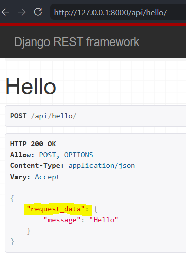
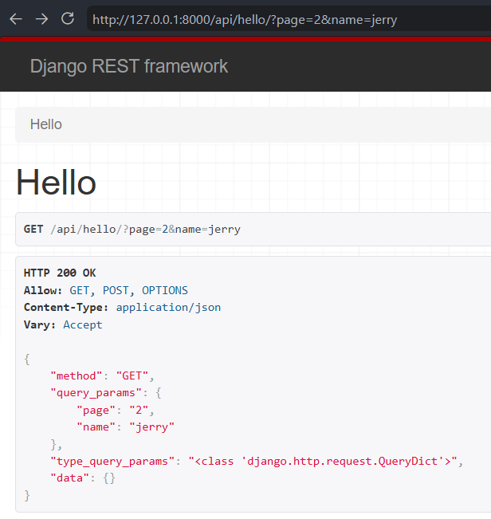
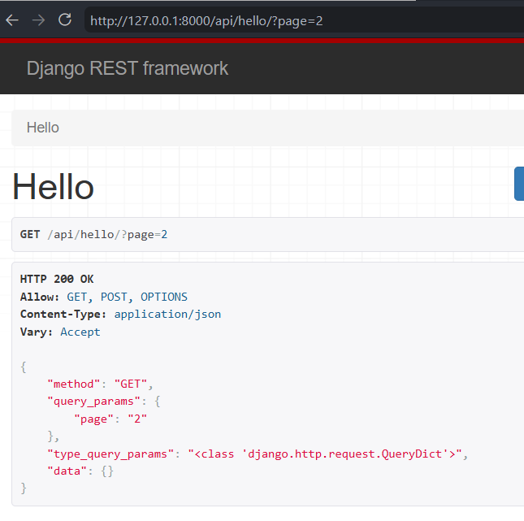
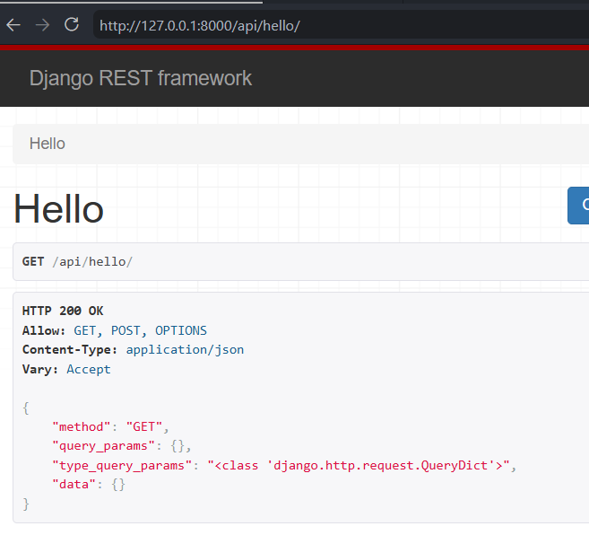
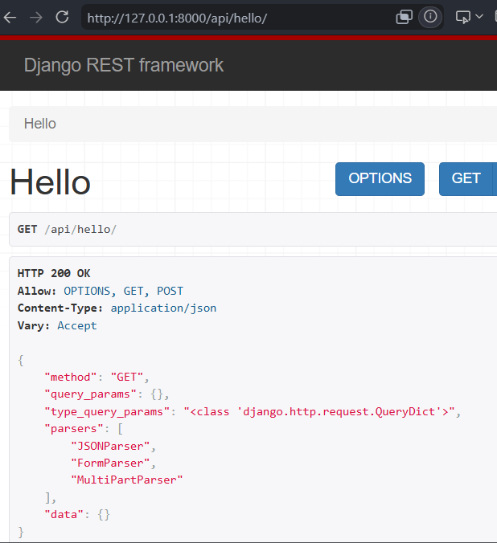
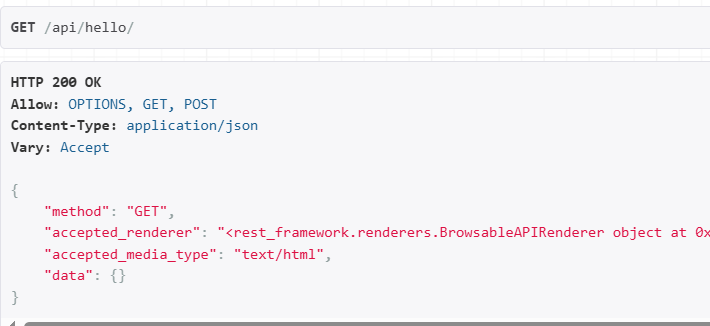
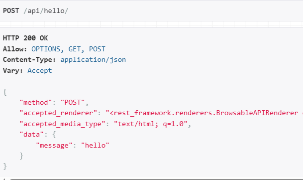
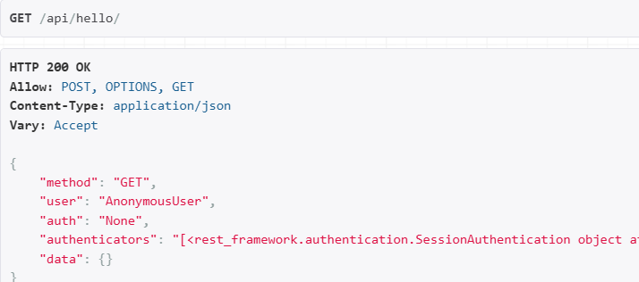
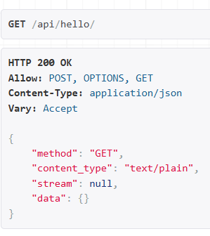
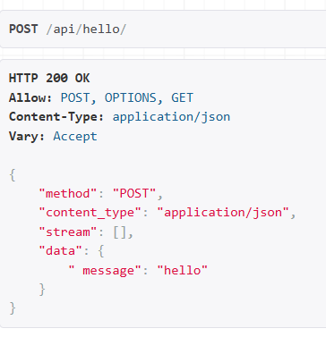

### Day 6: DRF Request 

***Request***
- Represents the incoming HTTP request sent by the client.
- Encapsulates request data, metadata, and authentication information.
- `Request` extends Django's `HttpRequest`.
- It provides all `HttpRequest` functionality along with DRF-specific features such as parsers, content negotiation, and authentication.
- Provides convenient attributes such as `request.data`, `request.query_params`, `request.user`, and `request.auth`.

***Request Parsing***
- `request.data` contains parsed request body data.
- Supports JSON and other request formats.
- Use `request.data` instead of `request.POST` in DRF.
- `request.query_params` contains URL query parameters.
- `request.user` gives the authenticated user.

**1. request.data:** returns the parsed content of the request body
- use hello function in views.py to see request.data
```python
@api_view(['POST'])
def hello(request):
    return Response({
        "request_data": request.data
        })
```

- Open Browser endpoint `/api/hello`  
- POST following JSON request
```JSON
{
      "message": "Hello"
}
```
- observe the POST request.data


**2. request.query_params:** 
- Contains URL query parameters.
- Access values sent after `?` in the URL.
- Similar to a dictionary.
- `request.query_params` is a Django `QueryDict`, a dictionary-like object for URL query parameters.

- modify view function
``` python
return Response({
    "query_params": request.query_params
})
```
- visit endpoint multi-param `/api/hello/?page=2&name=jerry`


QueryDict → a Django data structure for storing query parameters (and form data).
`<QueryDict: {'page': ['2'], 'name': ['jerry']}>`
Notice the lists as values. That's because URLs can contain repeated keys, e.g.:
`/api/hello/?tag=python&tag=django`
A normal dict can't naturally represent multiple values for the same key, but QueryDict can.

one query param: `/api/hello/?page=2`


no query param: `/api/hello/`


**3. request.prasers:**
- Lists the parser classes available for the current request.
- Parsers convert the incoming request body into `request.data`.
- Contains the parser classes available for the current request.
 
```python
return Response({
    "parsers": [type(p).__name__ for p in request.parsers]
})
```
- JSONParser → Parses JSON request bodies.
- FormParser → Parses HTML form data (application/x-www-form-urlencoded).
- MultiPartParser → Parses multipart form data (typically file uploads).


***Content Negotiation***
- Determines the response format returned to the client.
- DRF selects a renderer based on the client's `Accept` header.
- The selected renderer is available through `request.accepted_renderer`.
- The selected media type is available through `request.accepted_media_type`.

add following to view function
```python
"accepted_renderer": str(request.accepted_renderer),
"accepted_media_type": request.accepted_media_type,
```

- In the DRF Browsable API, `accepted_media_type` is typically `text/html` because the browser requests an HTML response.

after POST:


***Authentication***
- `request.user` returns the authenticated user.
- `request.auth` contains authentication credentials (if any).
- `request.authenticators` lists the authentication classes used to authenticate the request.


***Browser Enhancements***
- `request.method` returns the HTTP method (GET, POST, PUT, DELETE, etc.).
- `request.content_type` returns the media type of the incoming request body.
- `request.stream` provides access to the raw incoming request body before parsing to `request.data`
GET → content_type: text/plain (no request body)

POST → content_type: application/json (you sent JSON)



***Flow:***
```
HTTP Request
      ↓
APIView
      ↓
Request
      ↓
Serializer
      ↓
Response
      ↓
Renderer
      ↓
HTTP Response
```