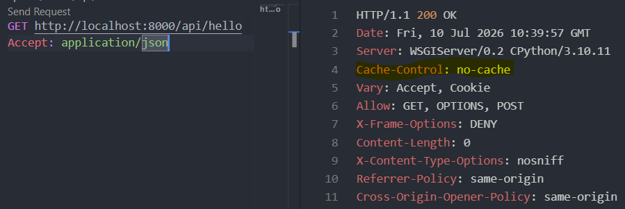

### Day 7: Response

- Represents the outgoing HTTP response returned to the client.
- Stores the response body in `response.data`.
- The renderer converts the `Response` object into the final HTTP response (e.g., JSON).


**Creating Response()** use following syntax  
`Response(data, status=None, template_name=None, headers=None, content_type=None)`  
data: serialized data for the response.  
status: for the response. Defaults to 200.  
template_name: to use if HTMLRenderer is selected.  
headers: A dictionary of HTTP headers to use in the response.  
content_type: The content type of the response. Typically, this will be set automatically by the renderer as determined by content negotiation, but there may be some cases where you need to specify the content type explicitly.

**Response attributes**  
***1) reponse.data:*** Contains the response body data before rendering.  
***2) response.status_code:*** Returns the HTTP status code of the response.  
***3) response.content:*** Contains the rendered response body as bytes after rendering.  
***4) response.template_name:*** Specifies the template used when rendering template-based responses.  
***5) response.accepted_renderer:*** Stores the renderer selected to generate the response.  
***6) response.accepted_media_type:*** Stores the media type selected for the response.  
***7) response.renderer_context:*** Contains context information used by the renderer during rendering.  

```python
@api_view(["GET", 'POST'])
def hello(request):
    response = Response({"message": "hello"})
    return Response({
        "type": str(type(response)),
        "response_data": response.data,
        "status_code": response.status_code,        
        "template_name": response.template_name,
        })
```

In `api.http`, send request to
```
GET http://localhost:8000/api/hello
Accept: application/json
```
Response:
```JSON
{
  "type": "<class 'rest_framework.response.Response'>",
  "response_data": {
    "message": "hello"
  },
  "status_code": 200,
  "template_name": null
}
```

**Note:**  
The attributes content, accepted_renderer, accepted_media_type, renderer_context are populated after rendering stage, hence cant be viewed inside Response object.  

***Modifying Response Header***
```python
@api_view(["GET", 'POST'])
def hello(request):
    response = Response()
    response['Cache-Control'] = 'no-cache'
    return response
```



***Flow:***
```
HTTP Request
      ↓
APIView
      ↓
Request
      ↓
Serializer
      ↓
Response
      ↓
Renderer
      ↓
HTTP Response
```